# BrainDrift 🧠
> AI-powered interview preparation platform — upload your resume, paste a job description, and get a personalized interview kit in seconds.

🌐 **Live Demo:** [braindrift.vercel.app](https://braindrift.vercel.app)

---

## 📸 Screenshots

### 🔐 Authentication
| Login | Register |
|---|---|
| 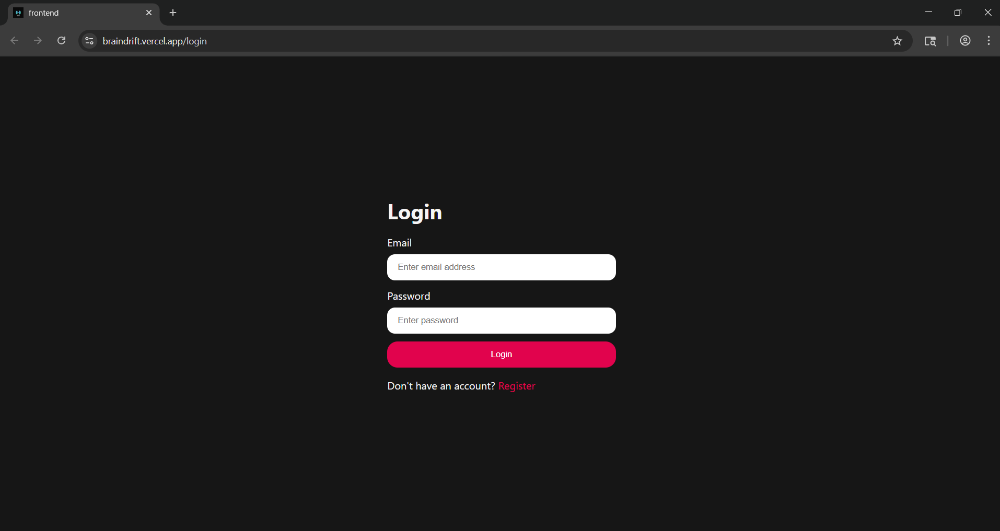 | 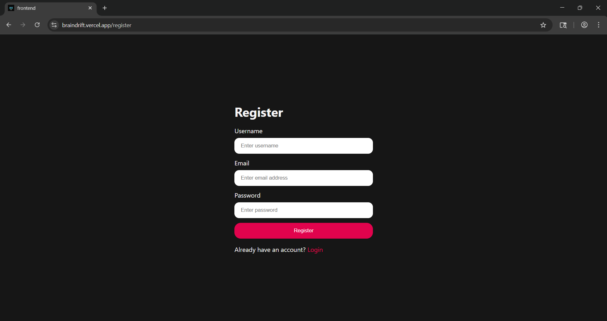 |

### 🏠 Home — Generate Interview Plan
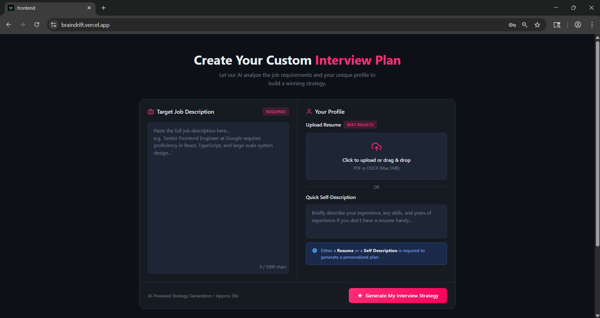

### 📊 Interview Report
| Technical Questions | Behavioral Questions |
|---|---|
| 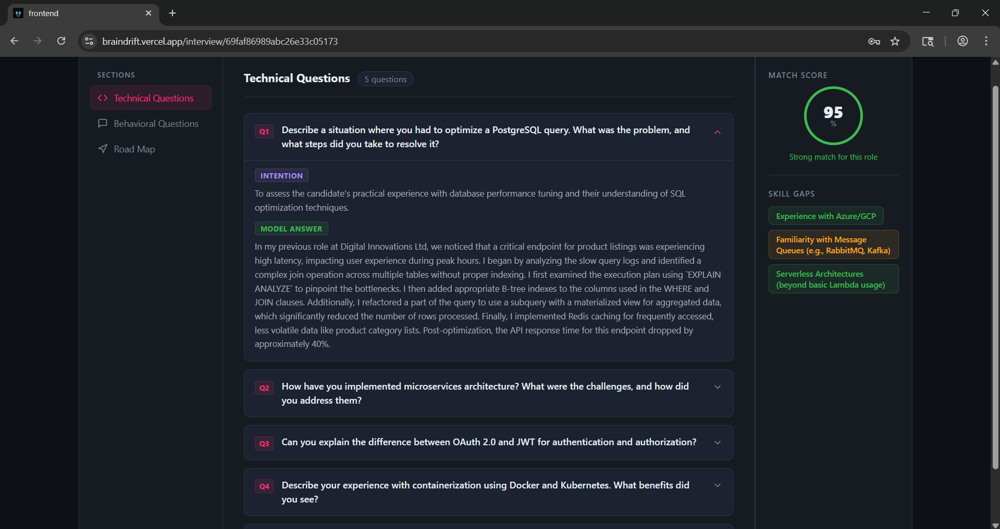 | 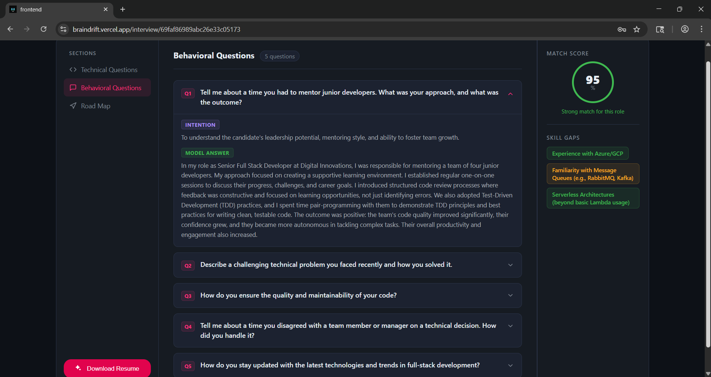 |

### 🗺️ Preparation Road Map
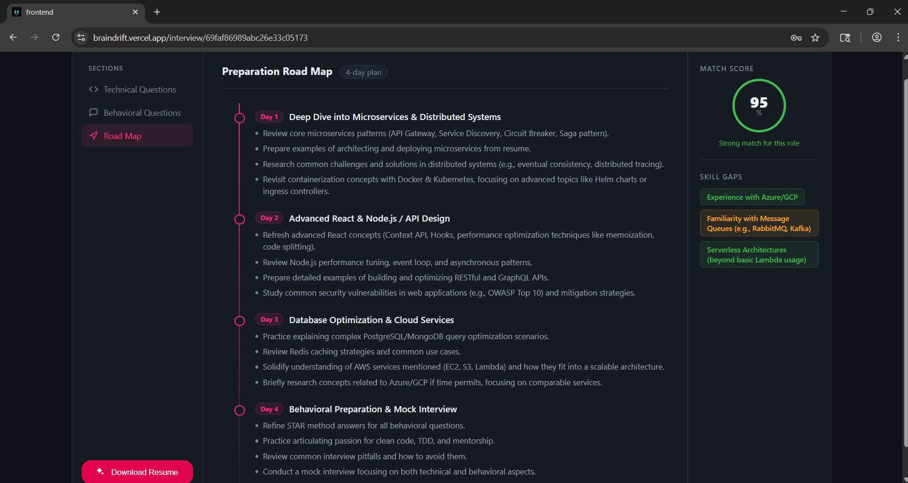

### 📄 AI-Generated Resume PDF - 1
| Page 1 | Page 2 |
|---|---|
| 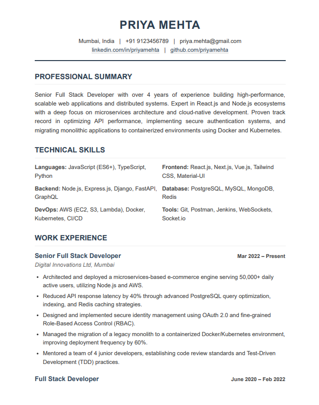 | 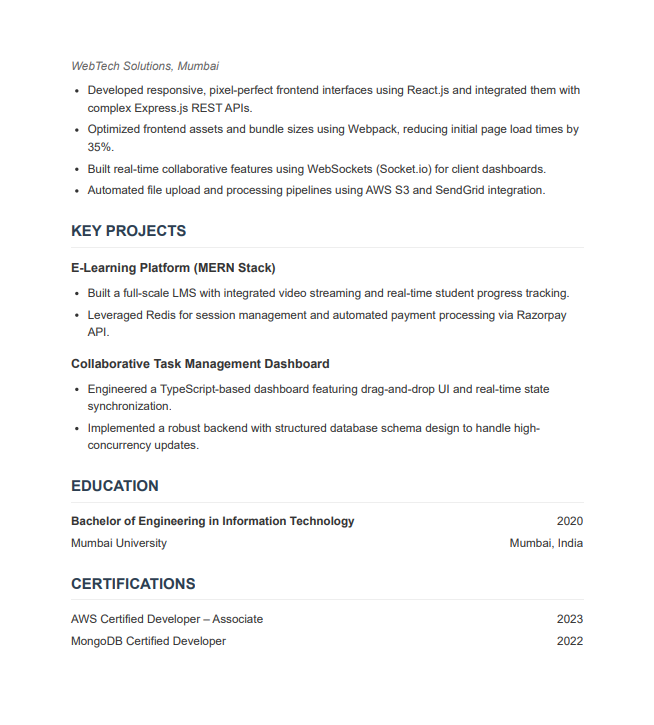 |

---
### 📄 AI-Generated Resume PDF - 2
| Page 1 | Page 2 | Page 3 |
|---|---|---|
| 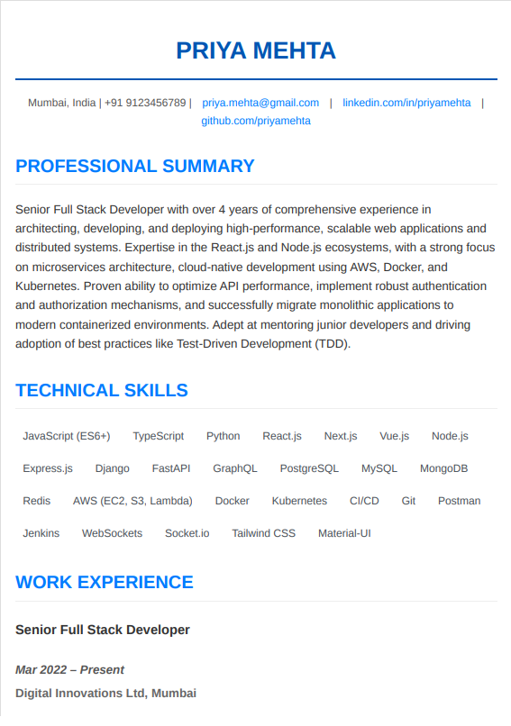 | 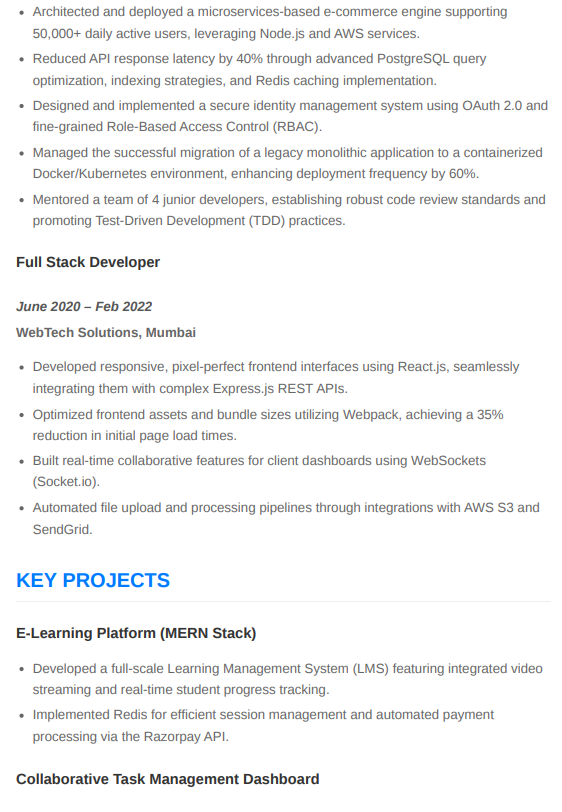 | 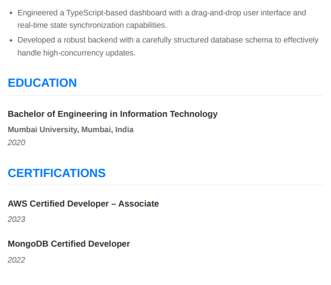 |

---

## ✨ Features

- 📄 **Resume Parsing** — Upload your resume as a PDF; the app extracts and analyses the content automatically
- 🤖 **AI Interview Report** — Powered by Google Gemini 2.5, generates a full report including:
  - **Match Score** (0–100) showing how well your resume aligns with the job
  - **Technical Questions** with model answers and interviewer intentions
  - **Behavioral Questions** with model answers and interviewer intentions
  - **Skill Gaps** with severity levels (low / medium / high)
  - **Personalised Preparation Plan** — number of days decided by AI based on your profile
- 📝 **AI Resume PDF Generator** — Generates a tailored, ATS-friendly resume PDF styled for the target job
- 🔐 **JWT Authentication** — Secure register / login / logout with cookie-based tokens and a token blacklist
- 📚 **Report History** — View all your past interview reports on the dashboard

---

## 🛠️ Tech Stack

### Frontend
| Technology | Purpose |
|---|---|
| React 19 + Vite | UI framework and build tool |
| React Router 7 | Client-side routing |
| Axios | HTTP client |
| SCSS | Styling |

### Backend
| Technology | Purpose |
|---|---|
| Node.js + Express 5 | Server and REST API |
| MongoDB + Mongoose | Database and ODM |
| Google Gemini AI (`@google/genai`) | Interview report & resume generation |
| Puppeteer + @sparticuz/chromium | HTML → PDF conversion (serverless-compatible) |
| pdf-parse | Extract text from uploaded resume PDFs |
| Multer | Resume file upload handling |
| JWT + bcryptjs | Authentication and password hashing |
| Zod | AI response schema validation |

### Deployment
| Service | Purpose |
|---|---|
| Vercel | Frontend hosting |
| Render | Backend hosting |
| MongoDB Atlas | Cloud database |

---

## 📁 Project Structure

```
BrainDrift/
├── Backend/
│   ├── server.js                     # Entry point
│   └── src/
│       ├── app.js                    # Express app setup, CORS, routes
│       ├── config/
│       │   └── database.js           # MongoDB connection
│       ├── controllers/
│       │   ├── auth.controller.js    # Register, login, logout, get-me
│       │   └── interview.controller.js # Report generation, PDF download
│       ├── middlewares/
│       │   ├── auth.middleware.js    # JWT verification
│       │   └── file.middleware.js    # Multer file upload config
│       ├── models/
│       │   ├── user.model.js         # User schema
│       │   ├── interviewReport.model.js # Interview report schema
│       │   └── blacklist.model.js    # JWT blacklist schema
│       ├── routes/
│       │   ├── auth.routes.js        # Auth API routes
│       │   └── interview.routes.js   # Interview API routes
│       └── services/
│           └── ai.service.js         # Gemini AI + Puppeteer logic
└── Frontend/
    └── src/
        ├── App.jsx
        ├── app.routes.jsx
        ├── features/
        │   ├── auth/                 # Login, Register pages + Protected route
        │   └── interview/
        │       ├── pages/
        │       │   ├── Home.jsx      # Dashboard — upload form + report history
        │       │   └── Interview.jsx # Report view — questions, roadmap, skill gaps
        │       ├── hooks/
        │       │   └── useInterview.js
        │       ├── services/
        │       │   └── interview.api.js
        │       ├── interview.context.jsx
        │       └── style/
        └── style/
```

---

## 🔌 API Reference

### Auth Routes — `/api/auth`

| Method | Endpoint | Description | Access |
|---|---|---|---|
| POST | `/register` | Register a new user | Public |
| POST | `/login` | Login with email & password | Public |
| GET | `/logout` | Logout and blacklist token | Public |
| GET | `/get-me` | Get current logged-in user | Private |

### Interview Routes — `/api/interview`

| Method | Endpoint | Description | Access |
|---|---|---|---|
| POST | `/` | Generate interview report (upload resume PDF) | Private |
| GET | `/` | Get all reports for logged-in user | Private |
| GET | `/report/:interviewId` | Get a single report by ID | Private |
| POST | `/resume/pdf/:interviewReportId` | Generate & download tailored resume PDF | Private |

---

## ⚙️ Local Setup

### Prerequisites
- Node.js >= 18
- MongoDB (local or Atlas)
- Google Gemini API key

### 1. Clone the repository

```bash
git clone https://github.com/rahulgoyal83789/BrainDrift.git
cd BrainDrift
```

### 2. Setup the Backend

```bash
cd Backend
npm install
```

Create a `.env` file in the `Backend/` folder:

```env
MONGO_URI=mongodb://localhost:27017/braindrift
JWT_SECRET=your_jwt_secret_here
GOOGLE_GENAI_API_KEY=your_gemini_api_key_here
PORT=3000
FRONTEND_URL=http://localhost:5173
```

```bash
npm run dev
```

### 3. Setup the Frontend

```bash
cd ../Frontend
npm install
npm run dev
```

Create a `.env` file in the `Frontend/` folder:

```env
VITE_API_URL=http://localhost:3000
```

---

## 🚀 How It Works

1. **Register / Login** to your account
2. On the **Home** dashboard, paste the job description and upload your resume PDF
3. Click **Generate My Interview Strategy** — Gemini AI analyses your profile against the job
4. View your **Interview Report** with:
   - Match score ring (0–100)
   - Technical & Behavioral questions with intentions and model answers
   - Preparation Road Map with a day-by-day study plan
   - Skill gaps with severity badges
5. Click **Download Resume** to get an AI-tailored, ATS-friendly PDF resume

---

## ☁️ Deployment

- **Frontend** → [Vercel](https://vercel.com) — auto-deploys on every push to `main`
- **Backend** → [Render](https://render.com) — auto-deploys on every push to `main`
- **Database** → MongoDB Atlas

**Backend env vars (Render):**
```env
MONGO_URI=your_mongodb_atlas_uri
JWT_SECRET=your_jwt_secret
GOOGLE_GENAI_API_KEY=your_gemini_api_key
FRONTEND_URL=https://braindrift.vercel.app
```

**Frontend env vars (Vercel):**
```env
VITE_API_URL=https://braindrift-backend.onrender.com
```

---

## 🤝 Contributing

Pull requests are welcome. For major changes, please open an issue first.

---

## 👨‍💻 Author

**Rahul Goyal** — [GitHub](https://github.com/rahulgoyal83789)